# 1. About TDCRPy

`TDCRPy` is a Python code to estimate detection efficiencies of liquid scintillation counters (TDCR or CIEMAT/NIST).
The calculation is based on a photo-physical stochastic model allowing to adress complexe decay schemes and radionuclide mixtures.

The code is developped and maintained by the BIPM (MIT license).

Technical details can be found in

http://dx.doi.org/10.13140/RG.2.2.15682.80321

## 1.1 Installation

`TDCRPy` requires that the following packages are installed in your `Python` environement.

```shell
pip install importlib.resources configparser numpy tqdm setuptools scipy
```
or in `conda` environement:

```shell
conda install importlib.resources configparser numpy tqdm setuptools scipy
```

Then, `TDCRPy` can be installed.

```shell
pip install TDCRPy
```

To obtain the last version.

```shell
pip install TDCRPy --upgrade
```

The module can be imported in your Python code such as.

```python
import tdcrpy
```

## 1.2 Test

To run the unit tests of the package:

```shell
python -m unittest tdcrpy.test.test_tdcrpy
```

or (using the coverage package)

```shell
coverage run -m unittest tdcrpy.test.test_tdcrpy
coverage report -m
```

# 2. Quick start with the TDCRPy code

```python
import tdcrpy
```

## 2.1 Symmetric PMTs

### 2.1.1 Estimation of detection efficiencies given the free parameter


```python
mode = "eff"               # ask for efficiency calculation
L = 1.2                    # free parameter in keV-1
Rad="Co-60"                # radionuclide
pmf_1="1"                  # relative fraction of the radionulide
N = 1000                   # number of Monte Carlo trials
kB =1.0e-5                 # Birks constant in cm keV-1
V = 10                     # volume of scintillator in mL
```


```python
result = tdcrpy.TDCRPy.TDCRPy(L, Rad, pmf_1, N, kB, V, mode)
```


```python
print(f"efficiency S = {round(result[0],4)} +/- {round(result[1],4)}")
print(f"efficiency D = {round(result[2],4)} +/- {round(result[3],4)}")
print(f"efficiency T = {round(result[4],4)} +/- {round(result[5],4)}")
print(f"efficiency D (C/N system) = {round(result[12],4)} +/- {round(result[13],4)}")
```

    efficiency S = 0.9859 +/- 0.0031
    efficiency D = 0.9738 +/- 0.0043
    efficiency T = 0.9527 +/- 0.0057
    efficiency D (C/N system) = 0.9702 +/- 0.0045
    

### 2.1.2 Estimation of detection efficiencies given the measured TDCR parameter


```python
TD = 0.977667386529166     # TDCR parameter
```


```python
result = tdcrpy.TDCRPy.eff(TD, Rad, pmf_1, kB, V)
```

    global free parameter = 1.1991314352332345 keV-1
    


```python
print(f"free parameter = {round(result[0],4)} keV-1")
print(f"efficiency S = {round(result[2],4)} +/- {round(result[3],4)}")
print(f"efficiency D = {round(result[4],4)} +/- {round(result[5],4)}")
print(f"efficiency T = {round(result[6],4)} +/- {round(result[7],4)}")
print(f"efficiency D (C/N system) = {round(result[14],4)} +/- {round(result[15],4)}")
```

    free parameter = 1.1991 keV-1
    efficiency S = 0.9858 +/- 0.001
    efficiency D = 0.973 +/- 0.0014
    efficiency T = 0.9512 +/- 0.0018
    efficiency D (C/N system) = 0.9692 +/- 0.0014
    

## 2.2 Asymmetric PMTs

### 2.2.1 Estimation of detection efficiencies given the free parameters


```python
mode = "eff"               # ask for efficiency calculation
L = (1.1, 1.3, 1.2)        # free parameter in keV-1
Rad="Co-60"                # radionuclide
pmf_1="1"                  # relative fraction of the radionulide
N = 1000                   # number of Monte Carlo trials
kB =1.0e-5                 # Birks constant in cm keV-1
V = 10                     # volume of scintillator in mL
```


```python
result = tdcrpy.TDCRPy.TDCRPy(L, Rad, pmf_1, N, kB, V)
```


```python
print(f"efficiency S = {round(result[0],4)} +/- {round(result[1],4)}")
print(f"efficiency D = {round(result[2],4)} +/- {round(result[3],4)}")
print(f"efficiency T = {round(result[4],4)} +/- {round(result[5],4)}")
print(f"efficiency AB = {round(result[6],4)} +/- {round(result[7],4)}")
print(f"efficiency BC = {round(result[8],4)} +/- {round(result[9],4)}")
print(f"efficiency AC = {round(result[10],4)} +/- {round(result[11],4)}")
print(f"efficiency D (C/N system) = {round(result[12],4)} +/- {round(result[13],4)}")
```

    efficiency S = 0.9904 +/- 0.0024
    efficiency D = 0.9803 +/- 0.0037
    efficiency T = 0.9625 +/- 0.005
    efficiency AB = 0.9684 +/- 0.0045
    efficiency BC = 0.9696 +/- 0.0044
    efficiency AC = 0.9674 +/- 0.0046
    efficiency D (C/N system) = 0.9772 +/- 0.0039
    

### 2.2.2 Estimation of detection efficiencies given the measured TDCR parameters


```python
TD = [0.977667386529166, 0.992232838598821, 0.992343419459002, 0.99275350064608]
```


```python
result = tdcrpy.TDCRPy.eff(TD, Rad, pmf_1, kB, V)
```

    global free parameter = 1.2369501044018718 keV-1
    free parameters = [1.2369501 1.2369501 1.2369501] keV-1
    


```python
print(f"Global free parameter = {round(result[0],4)} keV-1")
print(f"free parameter of PMT A = {round(result[1][0],4)} keV-1")
print(f"free parameter of PMT B = {round(result[1][1],4)} keV-1")
print(f"free parameter of PMT C = {round(result[1][2],4)} keV-1")
print(f"efficiency S = {round(result[2],4)} +/- {round(result[3],4)}")
print(f"efficiency D = {round(result[4],4)} +/- {round(result[5],4)}")
print(f"efficiency T = {round(result[6],4)} +/- {round(result[7],4)}")
print(f"efficiency AB = {round(result[8],4)} +/- {round(result[9],4)}")
print(f"efficiency BC = {round(result[10],4)} +/- {round(result[11],4)}")
print(f"efficiency AC = {round(result[12],4)} +/- {round(result[13],4)}")
print(f"efficiency D (C/N system) = {round(result[14],4)} +/- {round(result[15],4)}")
```

    Global free parameter = 1.237 keV-1
    free parameter of PMT A = 1.237 keV-1
    free parameter of PMT B = 1.237 keV-1
    free parameter of PMT C = 1.237 keV-1
    efficiency S = 0.9872 +/- 0.0009
    efficiency D = 0.9751 +/- 0.0013
    efficiency T = 0.9533 +/- 0.0018
    efficiency AB = 0.9606 +/- 0.0016
    efficiency BC = 0.9606 +/- 0.0016
    efficiency AC = 0.9606 +/- 0.0016
    efficiency D (C/N system) = 0.9714 +/- 0.0014
    

## 2.3 Radionuclide mixture

### 2.3.1 Estimation of detection efficiencies given the free parameter


```python
mode = "eff"               # ask for efficiency calculation
mode2 = "sym"              # specify that symmetric PMTs is considered
L = 1.2                    # free parameter in keV-1
Rad="Co-60, H-3"           # radionuclides
pmf_1="0.8, 0.2"                  # relatives fractions of the radionulides
N = 1000                   # number of Monte Carlo trials
kB =1.0e-5                 # Birks constant in cm keV-1
V = 10                     # volume of scintillator in mL
```


```python
result = tdcrpy.TDCRPy.TDCRPy(L, Rad, pmf_1, N, kB, V)
```


```python
print(f"efficiency S = {round(result[0],4)} +/- {round(result[1],4)}")
print(f"efficiency D = {round(result[2],4)} +/- {round(result[3],4)}")
print(f"efficiency T = {round(result[4],4)} +/- {round(result[5],4)}")
print(f"efficiency D (C/N system) = {round(result[12],4)} +/- {round(result[13],4)}")
```

    efficiency S = 0.9622 +/- 0.0045
    efficiency D = 0.9163 +/- 0.007
    efficiency T = 0.8482 +/- 0.0096
    efficiency D (C/N system) = 0.9037 +/- 0.0074
    

### 2.3.2 Estimation of detection efficiencies given the measured TDCR parameter


```python
TD = 0.977667386529166     # TDCR parameter
```


```python
result = tdcrpy.TDCRPy.eff(TD, Rad, pmf_1, kB, V)
```

    global free parameter = 4.999573818598962 keV-1
    


```python
print(f"free parameter = {round(result[0],4)} keV-1")
print(f"efficiency S = {round(result[2],4)} +/- {round(result[3],4)}")
print(f"efficiency D = {round(result[4],4)} +/- {round(result[5],4)}")
print(f"efficiency T = {round(result[6],4)} +/- {round(result[7],4)}")
print(f"efficiency D (C/N system) = {round(result[14],4)} +/- {round(result[15],4)}")
```

    free parameter = 4.9996 keV-1
    efficiency S = 0.9835 +/- 0.001
    efficiency D = 0.9677 +/- 0.0015
    efficiency T = 0.9397 +/- 0.002
    efficiency D (C/N system) = 0.9629 +/- 0.0016
    


```python

```

# 3. Advanced settings

```python
import tdcrpy as td
```

## 3.1 Read the parameters


```python
print("\nparameters in a list: ", td.TDCR_model_lib.readParameters(disp=True))
```

    number of integration bins for electrons = 1000
    number of integration bins for alpha = 1000
    density = 0.96 g/cm3
    Z = 5.2
    A = 11.04
    depth of spline interp. = 5
    energy above which interp. in implemented (for alpha) = 100.0 keV
    energy above which interp. in implemented (for electron) = 1.5 keV
    activation of the micelle correction = False
    diameter of micelle = 2.0 nm
    acqueous fraction = 0.1
    coincidence resolving time = 50 ns
    extended dead time = 10 µs
    measurement time = 20 min
    
    parameters in a list:  (1000, 1000, 0.96, 5.2, 11.04, 5, 100.0, 1.5, 2.0, 0.1, 50, 10, 20, False)
    

## 3.2 Change energy binning the quenching function of electrons 


```python
td.TDCR_model_lib.modifynE_electron(100)
print("New configuration:")
td.TDCR_model_lib.readParameters(disp=True)
# back to the default value
td.TDCR_model_lib.modifynE_electron(1000)
```

    New configuration:
    number of integration bins for electrons = 100
    number of integration bins for alpha = 1000
    density = 0.96 g/cm3
    Z = 5.2
    A = 11.04
    depth of spline interp. = 5
    energy above which interp. in implemented (for alpha) = 100.0 keV
    energy above which interp. in implemented (for electron) = 1.5 keV
    activation of the micelle correction = False
    diameter of micelle = 2.0 nm
    acqueous fraction = 0.1
    coincidence resolving time = 50 ns
    extended dead time = 10 µs
    measurement time = 20 min
    

## 3.3 Change energy binning the quenching function of alpha particles


```python
td.TDCR_model_lib.modifynE_alpha(100)
print("New configuration:")
td.TDCR_model_lib.readParameters(disp=True)
# back to the default value
td.TDCR_model_lib.modifynE_alpha(1000)
```

    New configuration:
    number of integration bins for electrons = 1000
    number of integration bins for alpha = 100
    density = 0.96 g/cm3
    Z = 5.2
    A = 11.04
    depth of spline interp. = 5
    energy above which interp. in implemented (for alpha) = 100.0 keV
    energy above which interp. in implemented (for electron) = 1.5 keV
    activation of the micelle correction = False
    diameter of micelle = 2.0 nm
    acqueous fraction = 0.1
    coincidence resolving time = 50 ns
    extended dead time = 10 µs
    measurement time = 20 min
    

## 3.4 Change the density (in g/cm3) of the LS source


```python
td.TDCR_model_lib.modifyDensity(1.02)
print("New configuration:")
td.TDCR_model_lib.readParameters(disp=True)
# back to the default value
td.TDCR_model_lib.modifyDensity(0.96)
```

    New configuration:
    number of integration bins for electrons = 1000
    number of integration bins for alpha = 1000
    density = 1.02 g/cm3
    Z = 5.2
    A = 11.04
    depth of spline interp. = 5
    energy above which interp. in implemented (for alpha) = 100.0 keV
    energy above which interp. in implemented (for electron) = 1.5 keV
    activation of the micelle correction = False
    diameter of micelle = 2.0 nm
    acqueous fraction = 0.1
    coincidence resolving time = 50 ns
    extended dead time = 10 µs
    measurement time = 20 min
    

## 3.5 Change the mean charge number of the LS source


```python
td.TDCR_model_lib.modifyZ(5.7)
print("New configuration:")
td.TDCR_model_lib.readParameters(disp=True)
# back to the default value
td.TDCR_model_lib.modifyZ(5.2)
```

    New configuration:
    number of integration bins for electrons = 1000
    number of integration bins for alpha = 1000
    density = 0.96 g/cm3
    Z = 5.7
    A = 11.04
    depth of spline interp. = 5
    energy above which interp. in implemented (for alpha) = 100.0 keV
    energy above which interp. in implemented (for electron) = 1.5 keV
    activation of the micelle correction = False
    diameter of micelle = 2.0 nm
    acqueous fraction = 0.1
    coincidence resolving time = 50 ns
    extended dead time = 10 µs
    measurement time = 20 min
    

## 3.6 Change the mean atomic mass number of the LS source


```python
td.TDCR_model_lib.modifyA(12.04)
print("New configuration:")
td.TDCR_model_lib.readParameters(disp=True)
# back to the default value
td.TDCR_model_lib.modifyA(11.04)
```

    New configuration:
    number of integration bins for electrons = 1000
    number of integration bins for alpha = 1000
    density = 0.96 g/cm3
    Z = 5.2
    A = 12.04
    depth of spline interp. = 5
    energy above which interp. in implemented (for alpha) = 100.0 keV
    energy above which interp. in implemented (for electron) = 1.5 keV
    activation of the micelle correction = False
    diameter of micelle = 2.0 nm
    acqueous fraction = 0.1
    coincidence resolving time = 50 ns
    extended dead time = 10 µs
    measurement time = 20 min
    

## 3.7 Change the depht paramerter of the spline interpolation of the quenching function


```python
td.TDCR_model_lib.modifyDepthSpline(7)
print("New configuration:")
td.TDCR_model_lib.readParameters(disp=True)
# back to the default value
td.TDCR_model_lib.modifyDepthSpline(5)
```

    New configuration:
    number of integration bins for electrons = 1000
    number of integration bins for alpha = 1000
    density = 0.96 g/cm3
    Z = 5.2
    A = 11.04
    depth of spline interp. = 7
    energy above which interp. in implemented (for alpha) = 100.0 keV
    energy above which interp. in implemented (for electron) = 1.5 keV
    activation of the micelle correction = False
    diameter of micelle = 2.0 nm
    acqueous fraction = 0.1
    coincidence resolving time = 50 ns
    extended dead time = 10 µs
    measurement time = 20 min
    

## 3.8 Change the energy threshold (in keV) above which the interpolation is applied (for alpha particles)


```python
td.TDCR_model_lib.modifyEinterp_a(200)
print("New configuration:")
td.TDCR_model_lib.readParameters(disp=True)
# back to the default value
td.TDCR_model_lib.modifyEinterp_a(100)
```

    New configuration:
    number of integration bins for electrons = 1000
    number of integration bins for alpha = 1000
    density = 0.96 g/cm3
    Z = 5.2
    A = 11.04
    depth of spline interp. = 5
    energy above which interp. in implemented (for alpha) = 200.0 keV
    energy above which interp. in implemented (for electron) = 1.5 keV
    activation of the micelle correction = False
    diameter of micelle = 2.0 nm
    acqueous fraction = 0.1
    coincidence resolving time = 50 ns
    extended dead time = 10 µs
    measurement time = 20 min
    

## 3.9 Change the energy threshold (in keV) above which the interpolation is applied (for electrons)


```python
td.TDCR_model_lib.modifyEinterp_e(2.0)
print("New configuration:")
td.TDCR_model_lib.readParameters(disp=True)
# back to the default value
td.TDCR_model_lib.modifyEinterp_e(1.5)
```

    New configuration:
    number of integration bins for electrons = 1000
    number of integration bins for alpha = 1000
    density = 0.96 g/cm3
    Z = 5.2
    A = 11.04
    depth of spline interp. = 5
    energy above which interp. in implemented (for alpha) = 100.0 keV
    energy above which interp. in implemented (for electron) = 2.0 keV
    activation of the micelle correction = False
    diameter of micelle = 2.0 nm
    acqueous fraction = 0.1
    coincidence resolving time = 50 ns
    extended dead time = 10 µs
    measurement time = 20 min
    

## 3.10 Activate/desactivate the micelles correction


```python
td.TDCR_model_lib.modifyMicCorr(False)
print("New configuration:")
td.TDCR_model_lib.readParameters(disp=True)
# back to the default value
td.TDCR_model_lib.modifyMicCorr(True)
```

    New configuration:
    number of integration bins for electrons = 1000
    number of integration bins for alpha = 1000
    density = 0.96 g/cm3
    Z = 5.2
    A = 11.04
    depth of spline interp. = 5
    energy above which interp. in implemented (for alpha) = 100.0 keV
    energy above which interp. in implemented (for electron) = 1.5 keV
    activation of the micelle correction = False
    diameter of micelle = 2.0 nm
    acqueous fraction = 0.1
    coincidence resolving time = 50 ns
    extended dead time = 10 µs
    measurement time = 20 min
    

## 3.11 Change the diameter of reverse micelles (in nm)


```python
td.TDCR_model_lib.modifyDiam_micelle(4.0)
print("New configuration:")
td.TDCR_model_lib.readParameters(disp=True)
# back to the default value
td.TDCR_model_lib.modifyDiam_micelle(2.0)
```

    New configuration:
    number of integration bins for electrons = 1000
    number of integration bins for alpha = 1000
    density = 0.96 g/cm3
    Z = 5.2
    A = 11.04
    depth of spline interp. = 5
    energy above which interp. in implemented (for alpha) = 100.0 keV
    energy above which interp. in implemented (for electron) = 1.5 keV
    activation of the micelle correction = False
    diameter of micelle = 4.0 nm
    acqueous fraction = 0.1
    coincidence resolving time = 50 ns
    extended dead time = 10 µs
    measurement time = 20 min
    

## 3.12 Change the acqueous fraction of the LS source


```python
td.TDCR_model_lib.modifyfAq(0.2)
print("New configuration:")
td.TDCR_model_lib.readParameters(disp=True)
# back to the default value
td.TDCR_model_lib.modifyfAq(0.1)
```

    New configuration:
    number of integration bins for electrons = 1000
    number of integration bins for alpha = 1000
    density = 0.96 g/cm3
    Z = 5.2
    A = 11.04
    depth of spline interp. = 5
    energy above which interp. in implemented (for alpha) = 100.0 keV
    energy above which interp. in implemented (for electron) = 1.5 keV
    activation of the micelle correction = False
    diameter of micelle = 2.0 nm
    acqueous fraction = 0.2
    coincidence resolving time = 50 ns
    extended dead time = 10 µs
    measurement time = 20 min
    

## 3.13 Change the coincidence resolving time of the TDCR counter (in ns)


```python
td.TDCR_model_lib.modifyTau(100)
print("New configuration:")
td.TDCR_model_lib.readParameters(disp=True)
# back to the default value
td.TDCR_model_lib.modifyTau(50)
```

    New configuration:
    number of integration bins for electrons = 1000
    number of integration bins for alpha = 1000
    density = 0.96 g/cm3
    Z = 5.2
    A = 11.04
    depth of spline interp. = 5
    energy above which interp. in implemented (for alpha) = 100.0 keV
    energy above which interp. in implemented (for electron) = 1.5 keV
    activation of the micelle correction = False
    diameter of micelle = 2.0 nm
    acqueous fraction = 0.1
    coincidence resolving time = 100 ns
    extended dead time = 10 µs
    measurement time = 20 min
    

## 3.14 Change the extended dead time of the TDCR counter (in µs)¶


```python
td.TDCR_model_lib.modifyDeadTime(100)
print("New configuration:")
td.TDCR_model_lib.readParameters(disp=True)
# back to the default value
td.TDCR_model_lib.modifyDeadTime(10)
```

    New configuration:
    number of integration bins for electrons = 1000
    number of integration bins for alpha = 1000
    density = 0.96 g/cm3
    Z = 5.2
    A = 11.04
    depth of spline interp. = 5
    energy above which interp. in implemented (for alpha) = 100.0 keV
    energy above which interp. in implemented (for electron) = 1.5 keV
    activation of the micelle correction = False
    diameter of micelle = 2.0 nm
    acqueous fraction = 0.1
    coincidence resolving time = 50 ns
    extended dead time = 100 µs
    measurement time = 20 min
    

## 3.15 Change the measurement time (in min)¶


```python
td.TDCR_model_lib.modifyMeasTime(60)
print("New configuration:")
td.TDCR_model_lib.readParameters(disp=True)
# back to the default value
td.TDCR_model_lib.modifyMeasTime(20)
```

    New configuration:
    number of integration bins for electrons = 1000
    number of integration bins for alpha = 1000
    density = 0.96 g/cm3
    Z = 5.2
    A = 11.04
    depth of spline interp. = 5
    energy above which interp. in implemented (for alpha) = 100.0 keV
    energy above which interp. in implemented (for electron) = 1.5 keV
    activation of the micelle correction = False
    diameter of micelle = 2.0 nm
    acqueous fraction = 0.1
    coincidence resolving time = 50 ns
    extended dead time = 10 µs
    measurement time = 60 min
    
# 4. Read Beta spectrum

```python
import tdcrpy as td
import matplotlib.pyplot as plt
import numpy as np
```


```python
radionuclide = "Sr-89"
mode = "beta-" # 'beta-' or 'beta+'
level = 'tot'  # 0,1,2,3 .... or 'tot'
```

## 4.1 Get information about the BetaShape version


```python
print(td.TDCR_model_lib.readBetaShapeInfo(radionuclide,mode,level))
```

    -Beta Spectrum of the main transition from BetaShape 2.4
     (05/2024), DDEP 2004 evaluation and Q-value from AME2020-
    

## 4.2 Read the energy spectrum tabulated from BetaShape


```python
energy, probability = td.TDCR_model_lib.readBetaShape(radionuclide,mode,level)

plt.figure("Energy spectrum")
plt.clf()
plt.plot(energy[:-1], probability)
plt.xlabel(r'$E$ /keV', fontsize=14)
plt.ylabel(r'$p(E)$ /(keV$^{-1}$)', fontsize=14)
```


    Text(0, 0.5, '$p(E)$ /(keV$^{-1}$)')


    
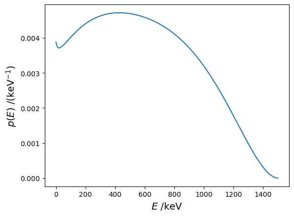
    


## 4.3 Read the deposited energy spectrum

This spectrum is built by TDCRPy (function `buildBetaSpectra`) to be used for the analytical TDCR model


```python
energy2, probability2 = td.TDCR_model_lib.readBetaSpectra(radionuclide)

plt.figure("Deposied energy spectrum")
plt.clf()
plt.plot(energy[:-1], probability,'-b', label="emitted energy spectrum")
plt.plot(energy2, probability2,'-r', label="deposited energy spectrum")
plt.legend(fontsize=14)
plt.xlabel(r'$E$ /keV', fontsize=14)
plt.ylabel(r'$p(E)$ /(keV$^{-1}$)', fontsize=14)
```


    Text(0, 0.5, '$p(E)$ /(keV$^{-1}$)')


    
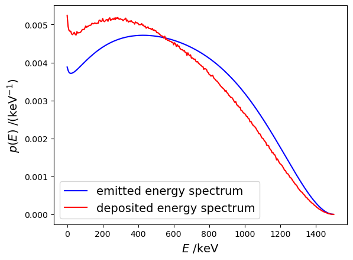
    


```python

```

# 5. Stopping power

```python
import tdcrpy as td
import matplotlib.pyplot as plt
import numpy as np
```

## 5.1 Stopping power at a given energy


```python
density = 0.96 # in g/cm3
energy = 100 # keV
result_alpha = td.TDCR_model_lib.stoppingpowerA(energy,rho=density)
result_electron = td.TDCR_model_lib.stoppingpower(energy*1e3,rho=density)
print(f"dE/dx = {result_alpha:.7g} keV/cm for alpha particles" )
print(f"dE/dx = {result_electron*1e3:.4g} keV/cm for electrons" )
```

    dE/dx = 1461120 keV/cm for alpha particles
    dE/dx = 3419 keV/cm for electrons
    

## 5.2 Plot stopping power curves


```python
energy_vec = np.logspace(-2,4,1000) # in keV
w_a, w_e = [], []
for e in energy_vec:
        w_a.append(td.TDCR_model_lib.stoppingpowerA(e,rho=density))
        w_e.append(1e3*td.TDCR_model_lib.stoppingpower(e*1e3,rho=density))
plt.figure("Stopping power")
plt.clf()
plt.plot(energy_vec,w_a,"-k",label="alpha particles")
plt.plot(energy_vec,w_e,"-r",label="electrons")
plt.xscale('log')
plt.xlabel(r'$E$ /keV', fontsize=14)
plt.ylabel(r'd$E$/d$x$ /(keV/cm)', fontsize=14)
plt.legend()
```


    <matplotlib.legend.Legend at 0x25d905a4c90>


    
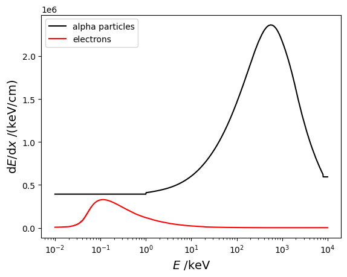
    
# 6. Scintillation quenching model

```python
import tdcrpy as td
import matplotlib.pyplot as plt
import numpy as np
```

## 6.1 Calculate the quenched energy from the Birks model


```python
kB = 0.01 # Birks constant in cm/MeV
ei = 1000  # initial energy in keV
ed = 1000  # deposited energy in keV
nE = 10000  # number of points of the energy linear space
eq_e=td.TDCR_model_lib.E_quench_e(ei*1e3,ed*1e3,kB,nE)*1e-3
print(f"For electrons       => Initial energy = {ei} keV, deposited energy = {ed} keV, quenched energy = {eq_e:.5g} keV")
eq_a=td.TDCR_model_lib.E_quench_a(ei,kB*1e-3,nE)
print(f"For alpha particles => Initial energy = {ei} keV, quenched energy = {eq_a:.5g} keV")
```

    For electrons       => Initial energy = 1000 keV, deposited energy = 1000 keV, quenched energy = 975.24 keV
    For alpha particles => Initial energy = 1000 keV, quenched energy = 48.934 keV
    

## 6.2 Correction of the micelle effect

The deposited energy ratios were evaluation by GEANT4-DNA [1].

[1] Nedjadi, Y., Laedermann, J.-P., Bochud, F., Bailat, C., 2017. On the reverse micelle effect in liquid scintillation counting. Applied Radiation and Isotopes 125, 94–107. https://doi.org/10.1016/j.apradiso.2017.04.020 


```python
energy_vec = np.logspace(-2,4,100) # in keV
fAq=0.1
s05, s1, s2, s3, s4, s5, s6, s7, s8, s10 = [], [], [], [], [], [], [], [], [], []
for e in energy_vec:
    s05.append(td.TDCR_model_lib.micelleLoss(e,fAq=fAq,diam_micelle=0.5))
    s1.append(td.TDCR_model_lib.micelleLoss(e,fAq=fAq,diam_micelle=1.0))
    s2.append(td.TDCR_model_lib.micelleLoss(e,fAq=fAq,diam_micelle=2.0))
    s3.append(td.TDCR_model_lib.micelleLoss(e,fAq=fAq,diam_micelle=3.0))
    s4.append(td.TDCR_model_lib.micelleLoss(e,fAq=fAq,diam_micelle=4.0))
    s5.append(td.TDCR_model_lib.micelleLoss(e,fAq=fAq,diam_micelle=5.0))
    s6.append(td.TDCR_model_lib.micelleLoss(e,fAq=fAq,diam_micelle=6.0))
    s7.append(td.TDCR_model_lib.micelleLoss(e,fAq=fAq,diam_micelle=7.0))
    s8.append(td.TDCR_model_lib.micelleLoss(e,fAq=fAq,diam_micelle=8.0))
    s10.append(td.TDCR_model_lib.micelleLoss(e,fAq=fAq,diam_micelle=10.0))

plt.figure("Deposited energy ratio")
plt.clf()
plt.plot(energy_vec,s05,label="$\Phi$=0.5 nm")
plt.plot(energy_vec,s1,label="$\Phi$=1.0 nm")
plt.plot(energy_vec,s2,label="$\Phi$=2.0 nm")
plt.plot(energy_vec,s3,label="$\Phi$=3.0 nm")
plt.plot(energy_vec,s4,label="$\Phi$=4.0 nm")
plt.plot(energy_vec,s5,label="$\Phi$=5.0 nm")
plt.plot(energy_vec,s6,label="$\Phi$=6.0 nm")
plt.plot(energy_vec,s7,label="$\Phi$=7.0 nm")
plt.plot(energy_vec,s8,label="$\Phi$=8.0 nm")
plt.plot(energy_vec,s10,label="$\Phi$=10.0 nm")
plt.xscale('log')
plt.xlabel(r'$E$ /keV', fontsize=14)
plt.ylabel(r'$S(E)/E$', fontsize=14)
plt.legend()
```


    <matplotlib.legend.Legend at 0x2dab792de10>


    
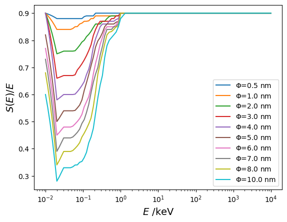
    


## 6.3 Scintillation quenching function from the Birks model (with micelle effect)


```python
energy_vec = np.logspace(-2,4,100) # in keV
fAq = 0.1 # acqueous fraction
diam_micelle = 4.0 # diameter of micelles (in nm) 

eq_a, eq_e, eq_e_m = [], [], []
for e in energy_vec:
        eq_e.append(td.TDCR_model_lib.E_quench_e(e*1e3,e*1e3,kB,nE)*1e-3)
        eq_e_m.append(td.TDCR_model_lib.E_quench_e(e*1e3,e*1e3,kB,nE)*1e-3*td.TDCR_model_lib.micelleLoss(e,fAq=fAq,diam_micelle=diam_micelle))
        eq_a.append(td.TDCR_model_lib.E_quench_a(e,kB*1e-3,nE))

plt.figure("Quenched Energy")
plt.clf()
plt.plot(energy_vec,eq_a/energy_vec,"-k",label="alpha particles")
plt.plot(energy_vec,eq_e/energy_vec,"-r",label="electrons")
plt.plot(energy_vec,eq_e_m/energy_vec,"--r",label="electrons (micelle effect)")
plt.xscale('log')
plt.xlabel(r'$E$ /keV', fontsize=14)
plt.ylabel(r'$Q_t(E)/E$', fontsize=14)
plt.legend()
```


    <matplotlib.legend.Legend at 0x2dab779f910>


    
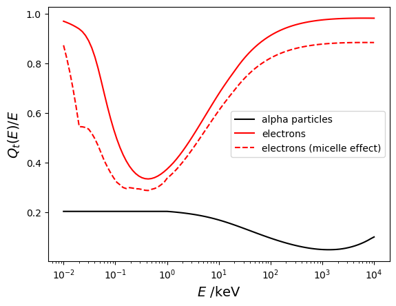
    


```python

```

```python
# 7. Interaction of ionizing particles
```

```python
# pip install opencv-python
```


```python
import tdcrpy as td
import matplotlib.pyplot as plt
import numpy as np
import cv2
```

## 7.1 Distributions for electrons from 0 keV to 200 keV


```python
A = td.TDCR_model_lib.Matrice10_e_1
C = np.flipud(A[0:])
C = np.clip(C, a_min=7e-6, a_max=1e-1)
C = np.log(C)
C = cv2.GaussianBlur(C, (3, 5), 10)
extent = [A[0,0], A[0,-1], 0, A[0,-1]]
x = np.arange(0, A[0,-1], A[0,-1]/10)
y = np.arange(0, A[0,-1], A[0,-1]/10)

plt.imshow(C, extent=extent, cmap='Greys', interpolation='nearest')
plt.colorbar()
plt.xticks(x)
plt.yticks(y)
plt.xlabel(r"$E_0$ /keV", fontsize=14)
plt.ylabel(r"$E_1$ /keV", fontsize=14)
plt.savefig("electrons_0-200.png")
plt.show()
```


    
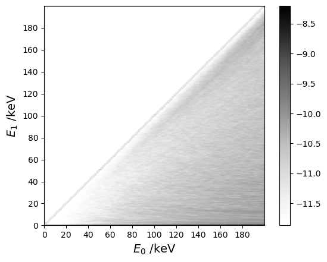
    


## 7.2 Distributions for electrons from 200 keV to 2 MeV


```python
A = td.TDCR_model_lib.Matrice10_e_2
C = np.flipud(A[0:])
C = np.clip(C, a_min=1e-5, a_max=1e-0)
C = np.log(C)
C = cv2.GaussianBlur(C, (3, 3), 20)
extent = [A[0,0], A[0,-1], 0, A[0,-1]]
x = np.arange(A[0,0], A[0,-1], A[0,-1]/10)
y = np.arange(0, A[0,-1], A[0,-1]/10)

plt.imshow(C, extent=extent, cmap='Greys', interpolation='nearest')
plt.colorbar()
plt.xticks(x, rotation=20)
plt.yticks(y)
plt.xlabel(r"$E_0$ /keV", fontsize=14)
plt.ylabel(r"$E_1$ /keV", fontsize=14)
plt.tight_layout()
plt.savefig("electrons_200-2000.png")
plt.show()
```


    
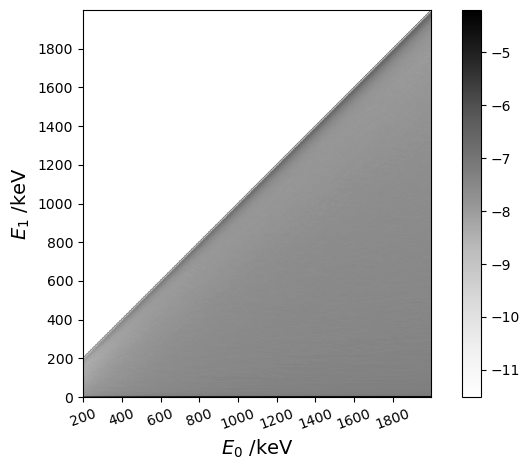
    


## 7.3 Distributions for electrons from 2 MeV to 8 MeV


```python
A = td.TDCR_model_lib.Matrice10_e_3
C = np.flipud(A[0:])
C = np.clip(C, a_min=1e-5, a_max=1e-0)
C = np.log(C)
C = cv2.GaussianBlur(C, (3, 3), 20)
extent = [A[0,0], A[0,-1], 0, A[0,-1]]
x = np.arange(A[0,0], A[0,-1], A[0,-1]/10)
y = np.arange(0, A[0,-1], A[0,-1]/10)

plt.imshow(C, extent=extent, cmap='Greys', interpolation='nearest')
plt.colorbar()
plt.xticks(x, rotation=20)
plt.yticks(y)
plt.xlabel(r"$E_0$ /keV", fontsize=14)
plt.ylabel(r"$E_1$ /keV", fontsize=14)
plt.tight_layout()
plt.savefig("electrons_2000-10000.png")
plt.show()
```


    
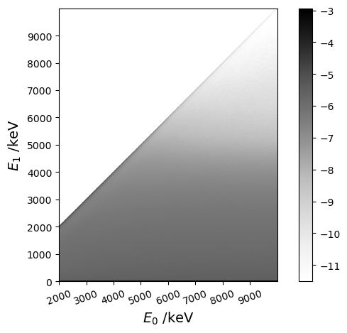
    


## 7.4 Distributions for photons from 0 keV to 200 keV


```python
A = td.TDCR_model_lib.Matrice10_p_1
C = np.flipud(A[0:])
C = np.clip(C, a_min=1e-7, a_max=1e0)
C = np.log(C)
C = cv2.GaussianBlur(C, (3, 3), 20)
extent = [A[0,0], A[0,-1], 0, A[0,-1]]
x = np.arange(0, A[0,-1], A[0,-1]/10)
y = np.arange(0, A[0,-1], A[0,-1]/10)

plt.imshow(C, extent=extent, cmap='Greys', interpolation='nearest')
plt.colorbar()
plt.xticks(x)
plt.yticks(y)
plt.xlabel(r"$E_0$ /keV", fontsize=14)
plt.ylabel(r"$E_1$ /keV", fontsize=14)
plt.savefig("photons_0-200.png")
plt.show()

x_1 = 1

# Find the column index for the given x_1
col_idx = np.searchsorted(A[0, :], x_1)

# Extract the corresponding y values from the column
y_1 = C[:, col_idx]
x_plot = 0.2*np.arange(0, len(y_1), 1)

print("escape probability = ",np.exp(y_1[-2])/sum(np.exp(y_1)))
# Plot the extracted values
plt.plot(x_plot,np.flipud(y_1))
plt.xlabel(r"$E_1$ /keV", fontsize=14)
plt.ylabel(r"log($P(E_1|E_0)$)", fontsize=14)
plt.title(f"Distribution for $x_1 = {x_1}$ keV")
plt.grid(True)
plt.xlim([0,x_1*1.5])
plt.savefig(f"distribution_x_{x_1}.png")
plt.show()
```


    
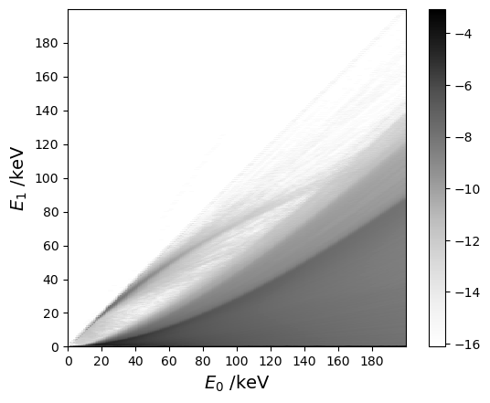
    
    escape probability =  0.5623307322837948
    
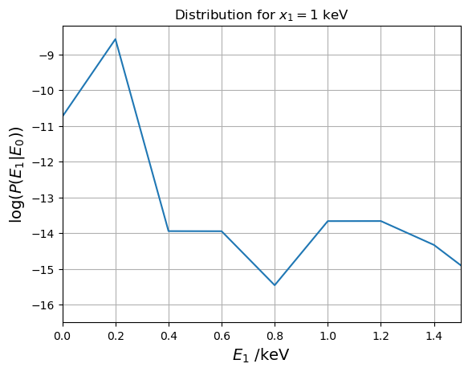
    


## 7.5 Distributions for photons from 200 keV to 2 MeV


```python
A = td.TDCR_model_lib.Matrice10_p_2
C = np.flipud(A[0:])
C = np.clip(C, a_min=1e-7, a_max=1e0)
C = np.log(C)
C = cv2.GaussianBlur(C, (3, 3), 20)
extent = [A[0,0], A[0,-1], 0, A[0,-1]]
x = np.arange(A[0,0], A[0,-1], A[0,-1]/10)
y = np.arange(0, A[0,-1], A[0,-1]/10)

plt.imshow(C, extent=extent, cmap='Greys', interpolation='nearest')
plt.colorbar()
plt.xticks(x, rotation=20)
plt.yticks(y)
plt.xlabel(r"$E_0$ /keV", fontsize=14)
plt.ylabel(r"$E_1$ /keV", fontsize=14)
plt.tight_layout()
plt.savefig("photons_200-2000.png")
plt.show()

x_1 = 2000

# Find the column index for the given x_1
col_idx = np.searchsorted(A[0, :], x_1)

# Extract the corresponding y values from the column
y_1 = np.log(A[:, col_idx])
x_plot = 2*np.arange(0, len(y_1), 1)

print("escape probability = ",np.exp(y_1[0]))
# Plot the extracted values
plt.plot(x_plot,y_1)
plt.xlabel(r"$E_1$ /keV", fontsize=14)
plt.ylabel(r"log($P(E_1|E_0)$)", fontsize=14)
plt.title(f"Distribution for $x_1 = {x_1}$ keV")
plt.grid(True)
plt.xlim([0,x_1*1.5])
plt.savefig(f"distribution_x_{x_1}.png")
plt.show()
```


    
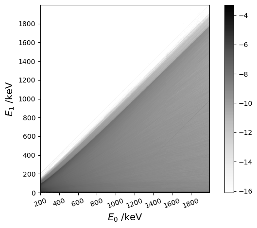
    
    escape probability =  1999.9999999999998
    
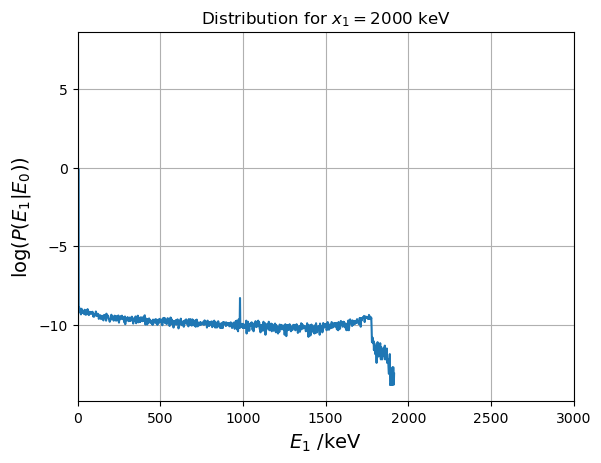
    


## 7.6 Distributions for photons from 2 MeV to 10 MeV


```python
A = td.TDCR_model_lib.Matrice10_p_3
C = np.flipud(A[1:])
C = np.clip(C, a_min=1e-6, a_max=1e-2)
C = np.log(C)
C = cv2.GaussianBlur(C, (5, 5), 20)
extent = [A[0,0], A[0,-1], 0, A[0,-1]]
x = np.arange(A[0,0], A[0,-1], A[0,-1]/10)
y = np.arange(0, A[0,-1], A[0,-1]/10)

plt.imshow(C, extent=extent, cmap='Greys', interpolation='nearest')
plt.colorbar()
plt.xticks(x, rotation=20)
plt.yticks(y)
plt.xlabel(r"$E_0$ /keV", fontsize=14)
plt.ylabel(r"$E_1$ /keV", fontsize=14)
plt.tight_layout()
plt.savefig("photons_2000-10000.png")
plt.show()

x_1 = 5000

# Find the column index for the given x_1
col_idx = np.searchsorted(A[0, :], x_1)

# Extract the corresponding y values from the column
y_1 = C[:, col_idx]
x_plot = 10*np.arange(0, len(y_1), 1)

print("escape probability = ",np.exp(y_1[-1])/sum(np.exp(y_1)))
# Plot the extracted values
plt.plot(x_plot,np.flipud(y_1))
plt.xlabel(r"$E_1$ /keV", fontsize=14)
plt.ylabel(r"log($P(E_1|E_0)$)", fontsize=14)
plt.title(f"Distribution for $x_1 = {x_1}$ keV")
plt.grid(True)
plt.xlim([0,x_1*1.5])
plt.savefig(f"distribution_x_{x_1}.png")
plt.show()
```


    
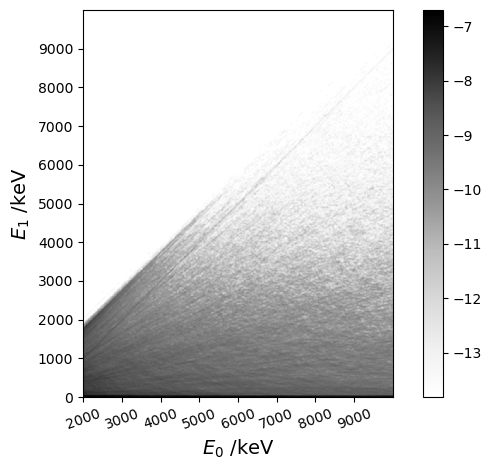
    
    escape probability =  0.03360101175407434
    

    


## 7.7 Sample a deposited energy given an initial energy


```python
ei = 100  # initial energy in keV
v = 10     # volume of the scintillator in mL
ed_g=td.TDCR_model_lib.energie_dep_gamma2(ei,v)
ed_e=td.TDCR_model_lib.energie_dep_beta2(ei,v)
print(f"The gamma ray of initial energy = {ei} keV, has deposited = {ed_g} keV in the scintillant.")
print(f"The electron of initial energy = {ei} keV, has deposited = {ed_e} keV in the scintillant.")
```

    The gamma ray of initial energy = 100 keV, has deposited = 0 keV in the scintillant.
    The electron of initial energy = 100 keV, has deposited = 100 keV in the scintillant.
    

## 7.8 Deposited energy of photons as a function of the sintillant volume


```python
V=np.arange(8,21,0.1)
N=100000
E=15    # initial energy in keV
e_vec, ue_vec = [], []
for v in V:
    x=[]
    for i in range(N):
        out=td.TDCR_model_lib.energie_dep_gamma2(15,v)
        x.append(out)
    e_vec.append(np.mean(x))
    ue_vec.append(np.std(x)/np.sqrt(N))

```


```python
plt.figure(r"Ed vs volume")
plt.clf()
plt.errorbar(V, e_vec, yerr=ue_vec, fmt="-k", label=rf'$E_0$ = {E} keV')
plt.legend()
plt.xlabel(r"$V$ /mL", fontsize=14)
plt.ylabel(r"$\bar{y}$ /(keV)", fontsize=14)
```

    
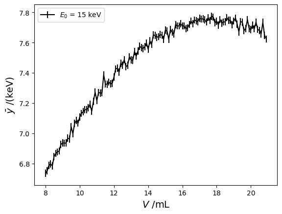
    

```python

```

# 8. Efficiency curves

```python
import tdcrpy as td
import numpy as np
from tqdm import tqdm
import matplotlib.pyplot as plt
```


```python
mode = "eff"                # ask for efficiency calculation
Rad="Co-60"                 # radionuclides
pmf_1="1"                   # relatives fractions of the radionulides
N = 1000                     # number of Monte Carlo trials
kB =1.0e-5                  # Birks constant in cm keV-1
V = 10                      # volume of scintillator in mL
L=np.logspace(-3,2,num=100) # free parameter in keV-1

# 8.1 Record decay histories in temporary files
td.TDCRPy.TDCRPy(L[0], Rad, pmf_1, N, kB, V, mode, barp=True, record=True)

effS, u_effS, effD, u_effD, effT, u_effT, effD2, u_effD2 = [], [],[], [],[], [], [], []
for l in tqdm(L, desc="free parameters ", unit=" iterations"):
  out = td.TDCRPy.TDCRPy(l, Rad, pmf_1, N, kB, V, mode, readRecHist=True)
  effS.append(out[2])
  u_effS.append(out[3])
  effD.append(out[2])
  u_effD.append(out[3])
  effT.append(out[4])
  u_effT.append(out[5])
  effD2.append(out[12])
  u_effD2.append(out[13])
```

    
     ______  ______  ______ _______  ________
    |__  __||  ___ \|  ___||  ___ | |  ____ |
      | |   | |  | || |    | |  | | | |___| |___     ___
      | |   | |  | || |    | |__| | |  _____|\  \   |  |
      | |   | |__| || |____|  __  \ | |       \  \  |  |
      |_|   |_____/ |_____||_|  \__\|_|        \  \_|  |
      +++++++++++++++++++++++++++++++++++++++++/      /
      ________________________________________/      /
     |______________________________________________/     
    
    
    version 2.0.2
    BIPM 2023 - license MIT 
    distribution: https://pypi.org/project/TDCRPy 
    developement: https://github.com/RomainCoulon/TDCRPy 
    
    start calculation...
    

    Processing: 100%|█████████████████████████████████████████████████████████████| 1000/1000 [00:24<00:00, 40.79 decays/s]
    free parameters : 100%|█████████████████████████████████████████████████████| 100/100 [00:02<00:00, 35.96 iterations/s]
    


```python
effS=np.asarray(effS)
effT=np.asarray(effT)
effD=np.asarray(effD)
effD2=np.asarray(effD2)
u_effS=np.asarray(u_effS)
u_effT=np.asarray(u_effT)
u_effD=np.asarray(u_effD)
u_effD2=np.asarray(u_effD2)

tdcr=effT/effD
u_tdcr=np.sqrt(u_effD**2*effT**2/effD**4+u_effT**2/effD**2)

plt.figure("efficiency vs free parameter")
plt.clf()
plt.errorbar(L,effD,yerr=u_effD,fmt="-k",label="double coincidences")
plt.errorbar(L,effT,yerr=u_effT,fmt="-r",label="triple coincidences")
plt.errorbar(L,effD2,yerr=u_effD2,fmt="-g",label="double coincidences (CIEMAT/NIST)")
plt.xscale('log')
plt.xlabel(r'$L$ /keV$^{-1}$', fontsize=14)
plt.ylabel(r'$\epsilon$', fontsize=14)
plt.legend()

plt.figure("efficiency vs TDCR")
plt.clf()
plt.errorbar(tdcr,effD,xerr=u_tdcr,yerr=u_effD,fmt="-k")
#plt.xscale('log')
plt.xlabel(r'$R_T/R_D$', fontsize=14)
plt.ylabel(r'$\epsilon_{D}$', fontsize=14)
```

    
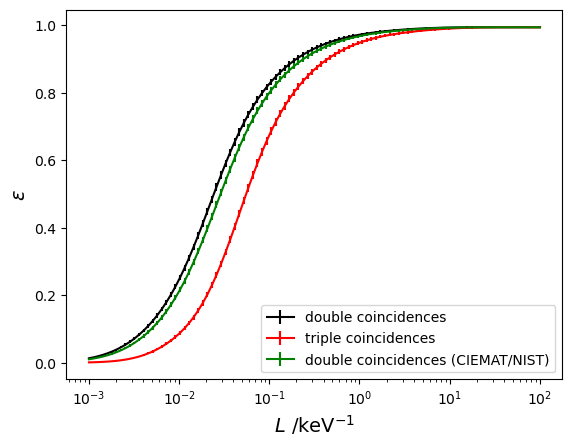
    
    
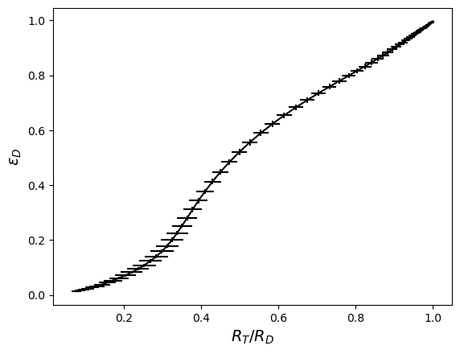
    

# 9. Efficiency with radionuclide mixtures

```python
import tdcrpy as td
import matplotlib.pyplot as plt
import numpy as np
from tqdm import tqdm
```

## 9.1 Fixed parameters

```python
mode = "eff"                # ask for efficiency calculation
Rad = "Fe-55, Ni-63"        # list of radionuclides
pmf_1="1"                   # relatives fractions of the radionulides
N = 1000                    # number of Monte Carlo trials
kB =1.0e-5                  # Birks constant in cm keV-1
V = 10                      # volume of scintillator in mL
L=1                         # free parameter in keV-1
```

## 9.2 Mixture parameters

```python
C = np.arange(0,1,0.05)     # relative fraction of the second nuclide
```

## 9.3 Efficiency calculation

```python
effS, ueffS, effD, ueffD, effT, ueffT, effD2, ueffD2 = [], [], [], [], [], [], [], []
for i in tqdm(C, desc="Processing items"):
    pmf_1 = f"{1-i}, {i}"
    result = td.TDCRPy.TDCRPy(L, Rad, pmf_1, N, kB, V, mode)
    effS.append(result[0]); ueffS.append(result[1])
    effD.append(result[2]); ueffD.append(result[3])
    effT.append(result[4]); ueffT.append(result[5])
    effD2.append(result[12]); ueffD2.append(result[13])
effD = np.asarray(effD); ueffD = np.asarray(ueffD)
effD2 = np.asarray(effD2); ueffD2 = np.asarray(ueffD2)
effT = np.asarray(effT); ueffT = np.asarray(ueffT)
TDCR = effT/effD
```

    Processing items: 100%|████████████████████████████████████████████████████████████████| 20/20 [03:52<00:00, 11.63s/it]
    

## 9.4 Plot the efficiency curves


```python
plt.figure("Stopping power")
plt.clf()
plt.errorbar(C,effD,yerr=2*ueffD,fmt="-k",label=r"$\epsilon_D$")
plt.errorbar(C,TDCR,yerr=2*ueffD,fmt="-r",label=r"$\epsilon_T/\epsilon_D$")
plt.errorbar(C,effD2,yerr=2*ueffD2,fmt="-g",label=r"$\epsilon_{D2}$ (CIEMAT/NIST)")
#plt.xscale('log')
plt.xlabel(f'relative fraction of {Rad.split(",")[1]}', fontsize=14)
plt.ylabel(r' ', fontsize=14)
plt.legend()
plt.savefig("stopping_power_plot.png")
```

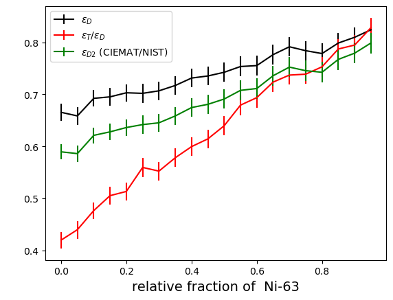
    
# 10. Dynamic efficiency estimation

This notebook presents how to link the `TDCRPy` package with the `radioactivedecay` package [1] to simulate dynamic TDCR measurements.

[1] Alex Malins & Thom Lemoine, radioactivedecay: A Python package for radioactive decay calculations. Journal of Open Source Software, 7 (71), 3318 (2022). https://doi.org/10.21105/joss.03318.


```python
# pip install radioactivedecay
```


```python
import radioactivedecay as rd
import tdcrpy as td
import numpy as np
import matplotlib.pyplot as plt
```

## 10.1 Input parameters


```python
radionuclide = 'Mo-99' # parent nuclide decaying during the measurement
activity_unit = "Bq"   # unit of the initial activity
time_unit = "h"        # time unit of the decay process
A0 = 1                 # initial activity (set to 1 in order to obtain relative activities)
coolingTime = 30.0     # the cooling time

mode = "eff"
L = 1                  # free parameter (keV-1)
kB = 1e-5              # Birks constant cm/keV
V = 10                 # volume of scintillator (mL)
N = 1000                # number of simulated decays
```

## 10.2 Run radioactivedecay


```python
rad_t0 = rd.Inventory({radionuclide: A0}, activity_unit)
rad_t1 = rad_t0.decay(coolingTime, time_unit)
A_t1 = rad_t1.activities(activity_unit)
As_t1 = sum(A_t1.values())
print(f"Activity at {coolingTime} {time_unit}") 
for key, val in A_t1.items(): print(f"\t {key}: {val} {activity_unit}")
print("Total activity = ", As_t1, activity_unit)
print(f"Relative activity at {coolingTime} {time_unit}")
for key, val in A_t1.items(): print(f"\t {key}: {val/As_t1}")
```

    Activity at 30.0 h
    	 Mo-99: 0.7295308772422591 Bq
    	 Ru-99: 0.0 Bq
    	 Tc-99: 7.44742326547114e-09 Bq
    	 Tc-99m: 0.6738301487178286 Bq
    Total activity =  1.4033610334075108 Bq
    Relative activity at 30.0 h
    	 Mo-99: 0.5198454708913215
    	 Ru-99: 0.0
    	 Tc-99: 5.306847695056773e-09
    	 Tc-99m: 0.4801545238018309
    

## 10.3 Display the decay graph


```python
nuc = rd.Nuclide(radionuclide)
nuc.plot()
```
    
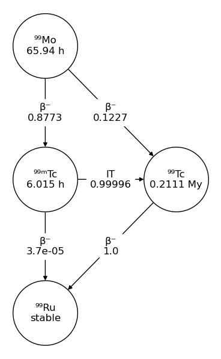
    
## 10.4 Display the decay curve


```python
rad_t0 .plot(coolingTime, time_unit, yunits=activity_unit)
```
    

    


## 10.5 Efficiency calculation as a function of the time


```python
timeVec = np.arange(0,30,2) # time vector
effS, ueffS, effD, ueffD, effT, ueffT, effD2, ueffD2 = [], [], [], [], [], [], [],[]
for t in timeVec:
    rad_t1 = rad_t0.decay(t, time_unit)
    A_t1 = rad_t1.activities(activity_unit)
    As_t1 = sum(A_t1.values())
    
    rads = ""; pmf1 = ""
    for key, val in A_t1.items():
        if key != "Pb-208" and key != "Ru-99":
            rads += ', '+key
            pmf1 += ', '+str(val/As_t1)
    rads = rads[2:]
    pmf1 = pmf1[2:]
    
    out=td.TDCRPy.TDCRPy(L, rads, pmf1, N, kB, V, mode)
    effD.append(out[2]); ueffD.append(out[3]); effT.append(out[4]); ueffT.append(out[5])
    effS.append(out[0]); ueffS.append(out[1]); effD2.append(out[12]); ueffD2.append(out[13])

effD = np.asarray(effD); effT = np.asarray(effT); ueffD = np.asarray(ueffD); ueffT = np.asarray(ueffT);
effD2 = np.asarray(effD2); effS = np.asarray(effS); ueffD2 = np.asarray(ueffD2); ueffS = np.asarray(ueffS);
tdcr = effT/effD
```
  

## 10.6 Plot efficiency curves


```python
# Create the plot
plt.figure(figsize=(10, 6))
plt.errorbar(timeVec, effS, yerr=ueffS, fmt='o', capsize=5, label=r'$\epsilon_S$')
plt.errorbar(timeVec, effD, yerr=ueffD, fmt='o', capsize=5, label=r'$\epsilon_D$')
plt.errorbar(timeVec, tdcr, yerr=ueffT , fmt='o', capsize=5, label=r'$\epsilon_T/\epsilon_D$')
plt.errorbar(timeVec, effD2, yerr=ueffD2, fmt='o', capsize=5, label=r'$\epsilon_D$ (CIEMAT/NIST)')

# Adding titles and labels
#plt.title('Efficiency (effD) as a Function of Time')
plt.xlabel(f'cooling time /{time_unit}',fontsize=16)
plt.ylabel(r'$\epsilon_D$ and $\epsilon_T/\epsilon_D$',fontsize=16)
plt.legend(fontsize=16)
plt.grid(True)

plt.savefig("plotDecay")
# Show the plot
plt.show()
```


    
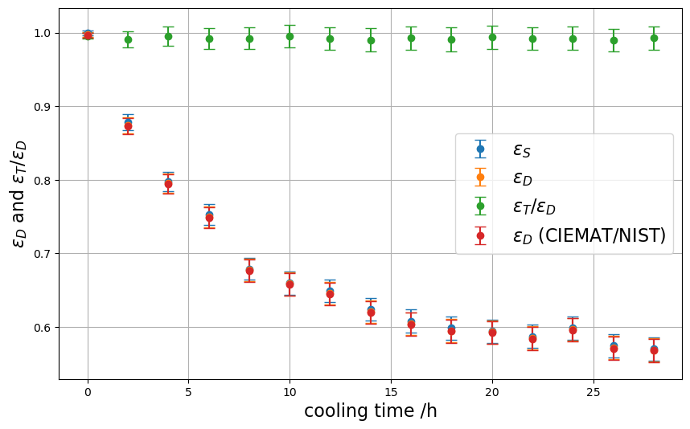
    


```python

```

