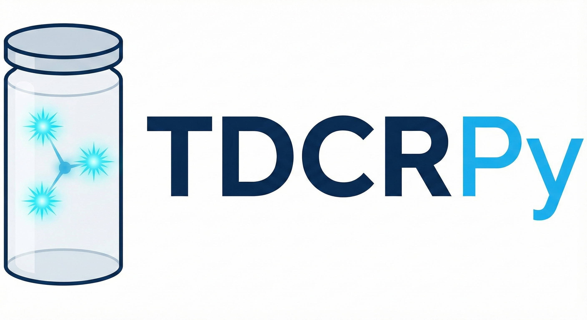

# TDCRPy

<div align="center">



**A Photo-Physical Stochastic Model for Liquid Scintillation Counting**


</div>

---

## 📖 Overview

**TDCRPy** is a Python package developed and maintained by the **BIPM** (Bureau International des Poids et Mesures). It estimates detection efficiencies of liquid scintillation counters using the **TDCR** (Triple to Double Coincidence Ratio) or **CIEMAT/NIST** methods.

The calculation is based on a photo-physical stochastic Monte Carlo model, allowing users to address:

* Complex decay schemes (beta spectra via BetaShape, gamma interactions via MCNP matrices).
* Radionuclide mixtures with arbitrary activity fractions.
* Ionisation quenching via the Birks model (electrons and alpha particles).
* Reverse micelle effects in cocktails used for aqueous samples.
* Asymmetric PMT configurations (per-channel free parameters).
* Dynamic efficiency evolution over time (with `radioactivedecay`).
* Full optical Monte Carlo transport (`opticalTransport=True`).

Technical details are described in:

* [Coulon et al., *Applied Radiation and Isotopes* (2024)](https://doi.org/10.1016/j.apradiso.2024.111518)
* [Coulon et al., BIPM Technical Report](http://dx.doi.org/10.13140/RG.2.2.15682.80321)

---

## 📦 Installation

TDCRPy requires Python ≥ 3.11 and a standard scientific environment.

```shell
pip install TDCRPy
```

To upgrade to the latest version:

```shell
pip install TDCRPy --upgrade
```

### Run Tests

Verify the installation by running the unit tests:

```shell
python -m unittest tdcrpy.test.test_tdcrpy
```

---

## ⚡ Quick Start

Estimate detection efficiencies for **Co-60** using the full stochastic model.

```python
import tdcrpy

L    = 1.2      # free parameter (photons keV⁻¹)
Rad  = "Co-60"  # radionuclide
pmf  = "1"      # activity fraction (100 %)
N    = 10000    # Monte Carlo trials (≥ 10 000 recommended)
kB   = 1.0e-5   # Birks constant (cm keV⁻¹)
V    = 10       # scintillator volume (mL)

result = tdcrpy.TDCRPy.TDCRPy(L, Rad, pmf, N, kB, V)

print(f"eff_S = {result[0]:.4f} ± {result[1]:.4f}")   # single events
print(f"eff_D = {result[2]:.4f} ± {result[3]:.4f}")   # double coincidences
print(f"eff_T = {result[4]:.4f} ± {result[5]:.4f}")   # triple coincidences
```

### Find L from a Measured TDCR Ratio

```python
TD = 0.9776   # measured T/D ratio
result = tdcrpy.TDCRPy.eff(TD, Rad, pmf, kB, V)

print(f"L = {result[0]:.4f} photons/keV")
print(f"eff_T = {result[6]:.4f} ± {result[7]:.4f}")
```

---

## 🛠 Advanced Features

### Asymmetric PMT Configuration

Pass a 3-tuple for the free parameter to model per-channel asymmetry:

```python
L = (1.1, 1.3, 1.2)   # (L_A, L_B, L_C) in photons keV⁻¹
result = tdcrpy.TDCRPy.TDCRPy(L, "Co-60", "1", N, kB, V)

print(f"eff_AB = {result[6]:.4f}")   # A–B double coincidences
print(f"eff_BC = {result[8]:.4f}")
print(f"eff_AC = {result[10]:.4f}")
```

### Radionuclide Mixtures

Provide comma-separated nuclides and their relative activity fractions:

```python
result = tdcrpy.TDCRPy.TDCRPy(L, "Co-60, H-3", "0.8, 0.2", N, kB, V)
```

### Analytical Model (Pure Beta Emitters)

A faster, deterministic alternative for pure β⁻ nuclides:

```python
# Returns (L0, L_opt, eff_S, eff_D, eff_T)
result = tdcrpy.TDCRPy.effA(TD, "H-3", "1", kB, V)

print(f"L0 = {result[0]:.4f} photons/keV")
print(f"eff_T = {result[4]:.4f}")
```

### Full Optical Monte Carlo Transport

Enable stochastic photon-transport for each event: photons are sampled
from a Poisson distribution, distributed equally among PMTs, and converted
to photoelectrons via Binomial draws (quantum efficiency):

```python
result = tdcrpy.TDCRPy.TDCRPy(L, Rad, pmf, N, kB, V, opticalTransport=True)
```

### Dynamic Decay

Combine with `radioactivedecay` to track efficiency as a sample decays:

```python
import radioactivedecay as rd
import tdcrpy as td

inv0 = rd.Inventory({'Mo-99': 1.0}, 'Bq')
inv1 = inv0.decay(30.0, 'h')          # decay 30 h

acts  = inv1.activities('Bq')
total = sum(acts.values())
nucs  = ", ".join(k for k, v in acts.items() if v > 0)
fracs = ", ".join(str(v / total) for k, v in acts.items() if v > 0)

result = td.TDCRPy.TDCRPy(1.0, nucs, fracs, N, kB, V)
```

---

## ⚙️ Configuration & Physics

Display the current physics settings:

```python
import tdcrpy as td
td.TDCR_model_lib.readParameters(disp=True)
```

### Configuration Reference

| Parameter | Setter | Default | Unit | Description |
| :--- | :--- | :---: | :---: | :--- |
| Electron bins | `modifynE_electron(n)` | 1000 | — | Integration bins for electron quenching |
| Alpha bins | `modifynE_alpha(n)` | 1000 | — | Integration bins for alpha quenching |
| Stopping power | `modifysp_model(m)` | `tan_xia` | — | Low-energy model (`tan_xia`, `joy_luo`, …) |
| Birks parameter | `modifyChou_param(k)` | 0 | cm²/MeV² | Chou bimolecular quenching constant |
| Density | `modifyDensity(ρ)` | 0.96 | g/cm³ | Scintillator density |
| Mean Z / A | `modifyZ(z)`, `modifyA(a)` | 5.2 / 11.04 | — | Effective atomic/mass number |
| Cocktail | `modifyLScocktail(name, fAq)` | False | — | LS cocktail + aqueous fraction |
| Micelle correction | `modifyMicCorr(b)` | False | — | Activate reverse-micelle correction |
| Micelle diameter | `modifyDiam_micelle(d)` | 2 | nm | Mean micelle diameter |
| Quantum efficiency | `modifyEffQ(q)` | `0.1,0.1,0.1` | — | PMT quantum efficiencies (A, B, C) |
| Optical transport | `modifyOpticalTransport(b)` | False | — | Enable full optical MC transport |
| Resolving time | `modifyTau(τ)` | 50 | ns | Coincidence resolving time |
| Dead time | `modifyDeadTime(t)` | 10 | µs | Extended dead time |
| Measurement time | `modifyMeasTime(T)` | 20 | min | Measurement duration |

---

## 📓 Tutorials

| Notebook | Description |
| :--- | :--- |
| [tuturial.ipynb](https://github.com/RomainCoulon/TDCRPy/blob/main/notebooks/tuturial.ipynb) | End-to-end stochastic model walkthrough |
| [analyticalModel.ipynb](https://github.com/RomainCoulon/TDCRPy/blob/main/notebooks/analyticalModel.ipynb) | Analytical model for pure beta emitters |
| [opticalTransport.ipynb](https://github.com/RomainCoulon/TDCRPy/blob/main/notebooks/opticalTransport.ipynb) | Semi-analytical vs optical MC transport |
| [changeParameters.ipynb](https://github.com/RomainCoulon/TDCRPy/blob/main/notebooks/changeParameters.ipynb) | Modifying physics parameters |
| [Co-60.ipynb](https://github.com/RomainCoulon/TDCRPy/blob/main/notebooks/Co-60.ipynb) | Co-60 efficiency calibration case study |
| [functional_validation.ipynb](https://github.com/RomainCoulon/TDCRPy/blob/main/notebooks/functional_validation.ipynb) | Version validation across nuclides and models |

---

## 📚 Citation

If you use **TDCRPy** in your work, please cite:

> R. Coulon, J. Hu — **TDCRPy: A Python package for TDCR measurements**  
> *Applied Radiation and Isotopes* (2024)  
> DOI: [10.1016/j.apradiso.2024.111518](https://doi.org/10.1016/j.apradiso.2024.111518)

---

## ⚖️ License

This project is licensed under the **MIT License**.  
Copyright © BIPM (Bureau International des Poids et Mesures).
