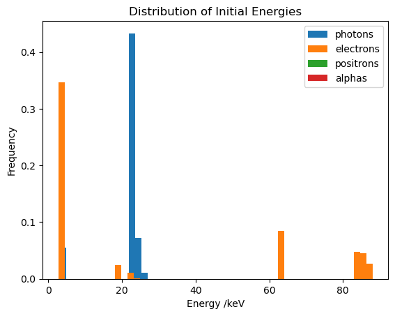
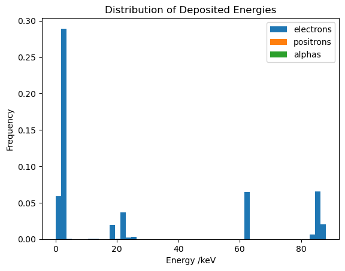
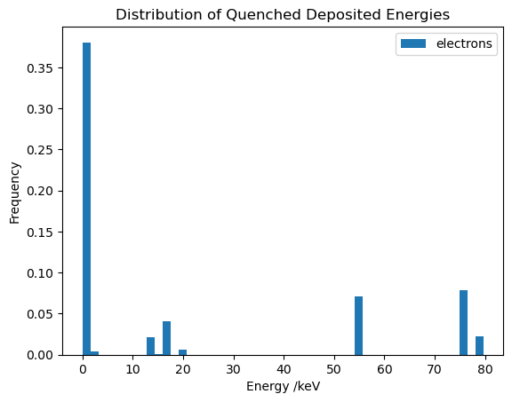
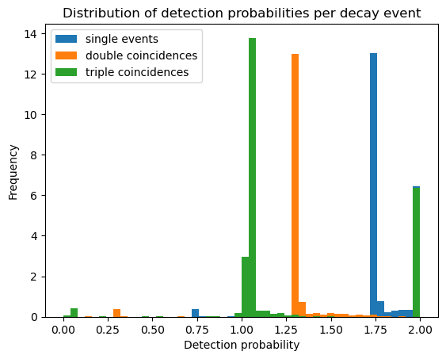

# Distribution of TDCR measurements


```python
# pip install TDCRPy --upgrade
```


```python
import tdcrpy as td
import numpy as np
from tqdm import tqdm
import matplotlib.pyplot as plt
```

## Record the decay histories in temporary files


```python
mode = "eff"                # ask for efficiency calculation
Rad="Cd-109"                # radionuclides
pmf_1="1"                   # relatives fractions of the radionulides
N = 1500                    # number of Monte Carlo trials
kB =1.0e-5                  # Birks constant in cm keV-1
V = 10                      # volume of scintillator in mL
L=1                         # free parameter in keV-1

out = td.TDCRPy.TDCRPy(1, Rad, pmf_1, N, kB, V, mode, record=True, barp=True)
```

    
     ______  ______  ______ _______  ________
    |__  __||  ___ \|  ___||  ___ | |  ____ |
      | |   | |  | || |    | |  | | | |___| |___     ___
      | |   | |  | || |    | |__| | |  _____|\  \   |  |
      | |   | |__| || |____|  __  \ | |       \  \  |  |
      |_|   |_____/ |_____||_|  \__\|_|        \  \_|  |
      +++++++++++++++++++++++++++++++++++++++++/      /
      ________________________________________/      /
     |______________________________________________/     
    
    
    version 2.0.2
    BIPM 2023 - license MIT 
    distribution: https://pypi.org/project/TDCRPy 
    developement: https://github.com/RomainCoulon/TDCRPy 
    
    start calculation...
    

    Processing: 100%|█████████████████████████████████████████████████████████████| 1500/1500 [00:46<00:00, 32.36 decays/s]
    

## Read initial energy from the decay process


```python
temp1, temp2, temp3, temp4 = td.TDCR_model_lib.read_temp_files()

ee_vec, eg_vec, ep_vec, ea_vec = td.TDCR_model_lib.energyVectors1(temp1)
nbins=50
plt.figure("1")
plt.hist(eg_vec, bins=nbins, edgecolor='none',density=True,label='photons')
plt.hist(ee_vec, bins=nbins, edgecolor='none',density=True,label='electrons')
plt.hist(ep_vec, bins=nbins, edgecolor='none',density=True,label='positrons')
plt.hist(ea_vec, bins=nbins, edgecolor='none',density=True,label='alphas')
plt.title('Distribution of Initial Energies')
plt.xlabel('Energy /keV')
plt.ylabel('Frequency')
plt.legend()
plt.show()
```

    C:\Users\romain.coulon\AppData\Local\anaconda3\Lib\site-packages\numpy\lib\histograms.py:885: RuntimeWarning: invalid value encountered in divide
      return n/db/n.sum(), bin_edges
    


    

    


## Read deposited energy in the scintillator


```python
ee_vec, ep_vec, ea_vec = td.TDCR_model_lib.energyVectors2(temp2)
nbins=50
plt.figure("2")
plt.hist(ee_vec, bins=nbins, edgecolor='none',density=True,label='electrons')
plt.hist(ep_vec, bins=nbins, edgecolor='none',density=True,label='positrons')
plt.hist(ea_vec, bins=nbins, edgecolor='none',density=True,label='alphas')
plt.title('Distribution of Deposited Energies')
plt.xlabel('Energy /keV')
plt.ylabel('Frequency')
plt.legend()
plt.show()
```


    

    


## Read quenched deposited energy in the scintillator


```python
ee_vec = td.TDCR_model_lib.energyVectors3(temp3)
nbins=50
plt.figure("3")
plt.hist(ee_vec, bins=nbins, edgecolor='none',density=True,label='electrons')
plt.title('Distribution of Quenched Deposited Energies')
plt.xlabel('Energy /keV')
plt.ylabel('Frequency')
plt.legend()
plt.show()
```


    

    


## Read detection probabilities per decay event


```python
s_vec, d_vec, t_vec = td.TDCR_model_lib.effVector(temp4)
nbins=50
plt.figure("4")
plt.hist(s_vec, bins=nbins, edgecolor='none',density=True,label='single events')
plt.hist(d_vec, bins=nbins, edgecolor='none',density=True,label='double coincidences')
plt.hist(t_vec, bins=nbins, edgecolor='none',density=True,label='triple coincidences')
plt.title('Distribution of detection probabilities per decay event')
plt.xlabel('Detection probability')
plt.ylabel('Frequency')
plt.legend()
plt.show()
```


    

    

