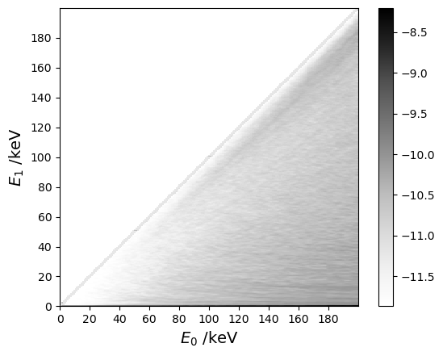
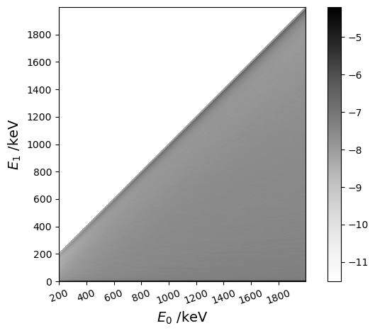
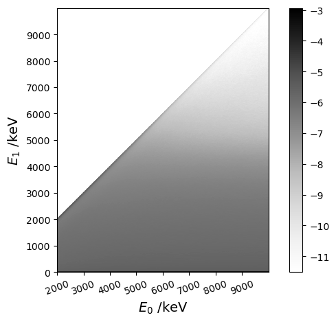
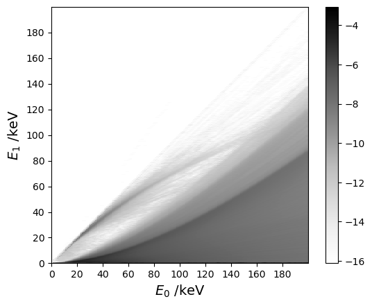
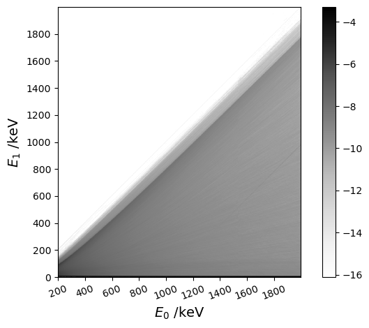
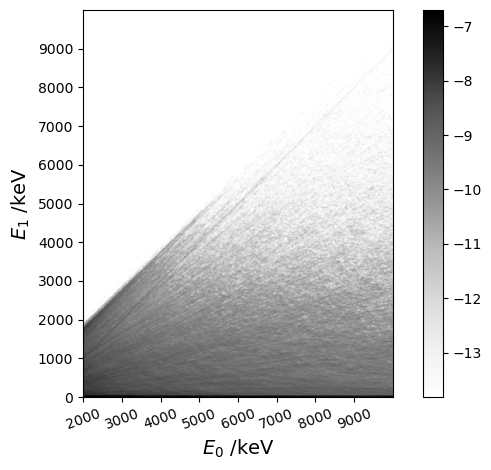

```python
# Simulation of the interaction of ionizing particles in the scintillant
```


```python
#pip install TDCRPy --upgrade
```


```python
# pip install opencv-python
```


```python
import tdcrpy as td
import matplotlib.pyplot as plt
import numpy as np
import cv2
```

## Response for a given initial energy

## Read bivariate distributions

### Electrons from 0 keV to 200 keV


```python
A = td.TDCR_model_lib.Matrice10_e_1
C = np.flipud(A[0:])
C = np.clip(C, a_min=7e-6, a_max=1e-1)
C = np.log(C)
C = cv2.GaussianBlur(C, (3, 5), 10)
extent = [A[0,0], A[0,-1], 0, A[0,-1]]
x = np.arange(0, A[0,-1], A[0,-1]/10)
y = np.arange(0, A[0,-1], A[0,-1]/10)

plt.imshow(C, extent=extent, cmap='Greys', interpolation='nearest')
plt.colorbar()
plt.xticks(x)
plt.yticks(y)
plt.xlabel(r"$E_0$ /keV", fontsize=14)
plt.ylabel(r"$E_1$ /keV", fontsize=14)
plt.savefig("electrons_0-200.png")
plt.show()
```


    

    


### Electrons from 200 keV to 2 MeV


```python
A = td.TDCR_model_lib.Matrice10_e_2
C = np.flipud(A[0:])
C = np.clip(C, a_min=1e-5, a_max=1e-0)
C = np.log(C)
C = cv2.GaussianBlur(C, (3, 3), 20)
extent = [A[0,0], A[0,-1], 0, A[0,-1]]
x = np.arange(A[0,0], A[0,-1], A[0,-1]/10)
y = np.arange(0, A[0,-1], A[0,-1]/10)

plt.imshow(C, extent=extent, cmap='Greys', interpolation='nearest')
plt.colorbar()
plt.xticks(x, rotation=20)
plt.yticks(y)
plt.xlabel(r"$E_0$ /keV", fontsize=14)
plt.ylabel(r"$E_1$ /keV", fontsize=14)
plt.tight_layout()
plt.savefig("electrons_200-2000.png")
plt.show()
```


    

    


### Electrons from 2 MeV to 8 MeV


```python
A = td.TDCR_model_lib.Matrice10_e_3
C = np.flipud(A[0:])
C = np.clip(C, a_min=1e-5, a_max=1e-0)
C = np.log(C)
C = cv2.GaussianBlur(C, (3, 3), 20)
extent = [A[0,0], A[0,-1], 0, A[0,-1]]
x = np.arange(A[0,0], A[0,-1], A[0,-1]/10)
y = np.arange(0, A[0,-1], A[0,-1]/10)

plt.imshow(C, extent=extent, cmap='Greys', interpolation='nearest')
plt.colorbar()
plt.xticks(x, rotation=20)
plt.yticks(y)
plt.xlabel(r"$E_0$ /keV", fontsize=14)
plt.ylabel(r"$E_1$ /keV", fontsize=14)
plt.tight_layout()
plt.savefig("electrons_2000-10000.png")
plt.show()
```


    

    


### Photons from 0 keV to 200 keV


```python
A = td.TDCR_model_lib.Matrice10_p_1
C = np.flipud(A[0:])
C = np.clip(C, a_min=1e-7, a_max=1e0)
C = np.log(C)
C = cv2.GaussianBlur(C, (3, 3), 20)
extent = [A[0,0], A[0,-1], 0, A[0,-1]]
x = np.arange(0, A[0,-1], A[0,-1]/10)
y = np.arange(0, A[0,-1], A[0,-1]/10)

plt.imshow(C, extent=extent, cmap='Greys', interpolation='nearest')
plt.colorbar()
plt.xticks(x)
plt.yticks(y)
plt.xlabel(r"$E_0$ /keV", fontsize=14)
plt.ylabel(r"$E_1$ /keV", fontsize=14)
plt.savefig("photons_0-200.png")
plt.show()

x_1 = 1

# Find the column index for the given x_1
col_idx = np.searchsorted(A[0, :], x_1)

# Extract the corresponding y values from the column
y_1 = C[:, col_idx]
x_plot = 0.2*np.arange(0, len(y_1), 1)

print("escape probability = ",np.exp(y_1[-2])/sum(np.exp(y_1)))
# Plot the extracted values
plt.plot(x_plot,np.flipud(y_1))
plt.xlabel(r"$E_1$ /keV", fontsize=14)
plt.ylabel(r"log($P(E_1|E_0)$)", fontsize=14)
plt.title(f"Distribution for $x_1 = {x_1}$ keV")
plt.grid(True)
plt.xlim([0,x_1*1.5])
plt.savefig(f"distribution_x_{x_1}.png")
plt.show()
```


    

    


    escape probability =  0.5623307322837948
    


    

    


### Photons from 200 keV to 2 MeV


```python
A = td.TDCR_model_lib.Matrice10_p_2
C = np.flipud(A[0:])
C = np.clip(C, a_min=1e-7, a_max=1e0)
C = np.log(C)
C = cv2.GaussianBlur(C, (3, 3), 20)
extent = [A[0,0], A[0,-1], 0, A[0,-1]]
x = np.arange(A[0,0], A[0,-1], A[0,-1]/10)
y = np.arange(0, A[0,-1], A[0,-1]/10)

plt.imshow(C, extent=extent, cmap='Greys', interpolation='nearest')
plt.colorbar()
plt.xticks(x, rotation=20)
plt.yticks(y)
plt.xlabel(r"$E_0$ /keV", fontsize=14)
plt.ylabel(r"$E_1$ /keV", fontsize=14)
plt.tight_layout()
plt.savefig("photons_200-2000.png")
plt.show()

x_1 = 2000

# Find the column index for the given x_1
col_idx = np.searchsorted(A[0, :], x_1)

# Extract the corresponding y values from the column
y_1 = np.log(A[:, col_idx])
x_plot = 2*np.arange(0, len(y_1), 1)

print("escape probability = ",np.exp(y_1[0]))
# Plot the extracted values
plt.plot(x_plot,y_1)
plt.xlabel(r"$E_1$ /keV", fontsize=14)
plt.ylabel(r"log($P(E_1|E_0)$)", fontsize=14)
plt.title(f"Distribution for $x_1 = {x_1}$ keV")
plt.grid(True)
plt.xlim([0,x_1*1.5])
plt.savefig(f"distribution_x_{x_1}.png")
plt.show()
```


    

    


    escape probability =  1999.9999999999998
    

    C:\Users\romain.coulon\AppData\Local\Temp\ipykernel_16916\4017156075.py:26: RuntimeWarning: divide by zero encountered in log
      y_1 = np.log(A[:, col_idx])
    


    

    


### Photons from 2 MeV to 10 MeV


```python
A = td.TDCR_model_lib.Matrice10_p_3
C = np.flipud(A[1:])
C = np.clip(C, a_min=1e-6, a_max=1e-2)
C = np.log(C)
C = cv2.GaussianBlur(C, (5, 5), 20)
extent = [A[0,0], A[0,-1], 0, A[0,-1]]
x = np.arange(A[0,0], A[0,-1], A[0,-1]/10)
y = np.arange(0, A[0,-1], A[0,-1]/10)

plt.imshow(C, extent=extent, cmap='Greys', interpolation='nearest')
plt.colorbar()
plt.xticks(x, rotation=20)
plt.yticks(y)
plt.xlabel(r"$E_0$ /keV", fontsize=14)
plt.ylabel(r"$E_1$ /keV", fontsize=14)
plt.tight_layout()
plt.savefig("photons_2000-10000.png")
plt.show()

x_1 = 5000

# Find the column index for the given x_1
col_idx = np.searchsorted(A[0, :], x_1)

# Extract the corresponding y values from the column
y_1 = C[:, col_idx]
x_plot = 10*np.arange(0, len(y_1), 1)

print("escape probability = ",np.exp(y_1[-1])/sum(np.exp(y_1)))
# Plot the extracted values
plt.plot(x_plot,np.flipud(y_1))
plt.xlabel(r"$E_1$ /keV", fontsize=14)
plt.ylabel(r"log($P(E_1|E_0)$)", fontsize=14)
plt.title(f"Distribution for $x_1 = {x_1}$ keV")
plt.grid(True)
plt.xlim([0,x_1*1.5])
plt.savefig(f"distribution_x_{x_1}.png")
plt.show()
```


    

    


    escape probability =  0.03360101175407434
    


    

    


## Sample a deposited energy given an initial energy


```python
ei = 100  # initial energy in keV
v = 10     # volume of the scintillator in mL
ed_g=td.TDCR_model_lib.energie_dep_gamma2(ei,v)
ed_e=td.TDCR_model_lib.energie_dep_beta2(ei,v)
print(f"The gamma ray of initial energy = {ei} keV, has deposited = {ed_g} keV in the scintillant.")
print(f"The electron of initial energy = {ei} keV, has deposited = {ed_e} keV in the scintillant.")
```

    The gamma ray of initial energy = 100 keV, has deposited = 0 keV in the scintillant.
    The electron of initial energy = 100 keV, has deposited = 100 keV in the scintillant.
    

## Deposited energy of photons as a function of the sintillant volume


```python
V=np.arange(8,21,0.1)
N=100000
E=15    # initial energy in keV
e_vec, ue_vec = [], []
for v in V:
    x=[]
    for i in range(N):
        out=td.TDCR_model_lib.energie_dep_gamma2(15,v)
        x.append(out)
    e_vec.append(np.mean(x))
    ue_vec.append(np.std(x)/np.sqrt(N))

```


```python
plt.figure(r"Ed vs volume")
plt.clf()
plt.errorbar(V, e_vec, yerr=ue_vec, fmt="-k", label=rf'$E_0$ = {E} keV')
plt.legend()
plt.xlabel(r"$V$ /mL", fontsize=14)
plt.ylabel(r"$\bar{y}$ /(keV)", fontsize=14)
```


    Text(0, 0.5, '$\\bar{y}$ /(keV)')


    

    


```python

```

