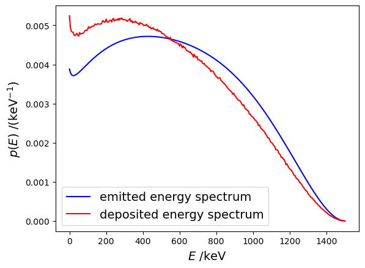

# Read Beta spectrum


```python
# pip install TDCRPy --upgrade
```


```python
import tdcrpy as td
import matplotlib.pyplot as plt
import numpy as np
```


```python
radionuclide = "Sr-89"
mode = "beta-" # 'beta-' or 'beta+'
level = 'tot' # 0,1,2,3 .... or 'tot'
```

## Get information about the BetaShape version


```python
print(td.TDCR_model_lib.readBetaShapeInfo(radionuclide,mode,level))
```

    -Beta Spectrum of the main transition from BetaShape 2.4
     (05/2024), DDEP 2004 evaluation and Q-value from AME2020-
    

## Read the energy spectrum tabulated from BetaShape


```python
energy, probability = td.TDCR_model_lib.readBetaShape(radionuclide,mode,level)

plt.figure("Energy spectrum")
plt.clf()
plt.plot(energy[:-1], probability)
plt.xlabel(r'$E$ /keV', fontsize=14)
plt.ylabel(r'$p(E)$ /(keV$^{-1}$)', fontsize=14)
```


    Text(0, 0.5, '$p(E)$ /(keV$^{-1}$)')


    

    


## Read the deposited energy spectrum

This spectrum is built by TDCRPy (function `buildBetaSpectra`) to be used for the analytical TDCR model


```python
energy2, probability2 = td.TDCR_model_lib.readBetaSpectra(radionuclide)

plt.figure("Deposied energy spectrum")
plt.clf()
plt.plot(energy[:-1], probability,'-b', label="emitted energy spectrum")
plt.plot(energy2, probability2,'-r', label="deposited energy spectrum")
plt.legend(fontsize=14)
plt.xlabel(r'$E$ /keV', fontsize=14)
plt.ylabel(r'$p(E)$ /(keV$^{-1}$)', fontsize=14)
```


    Text(0, 0.5, '$p(E)$ /(keV$^{-1}$)')


    

    


```python

```
